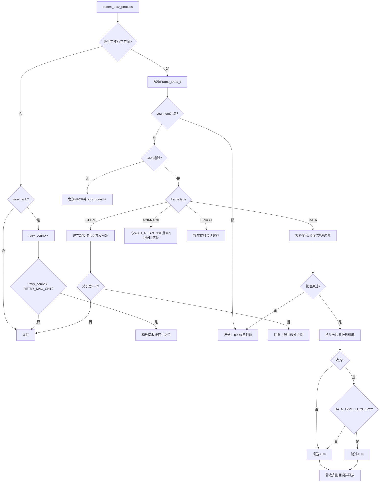
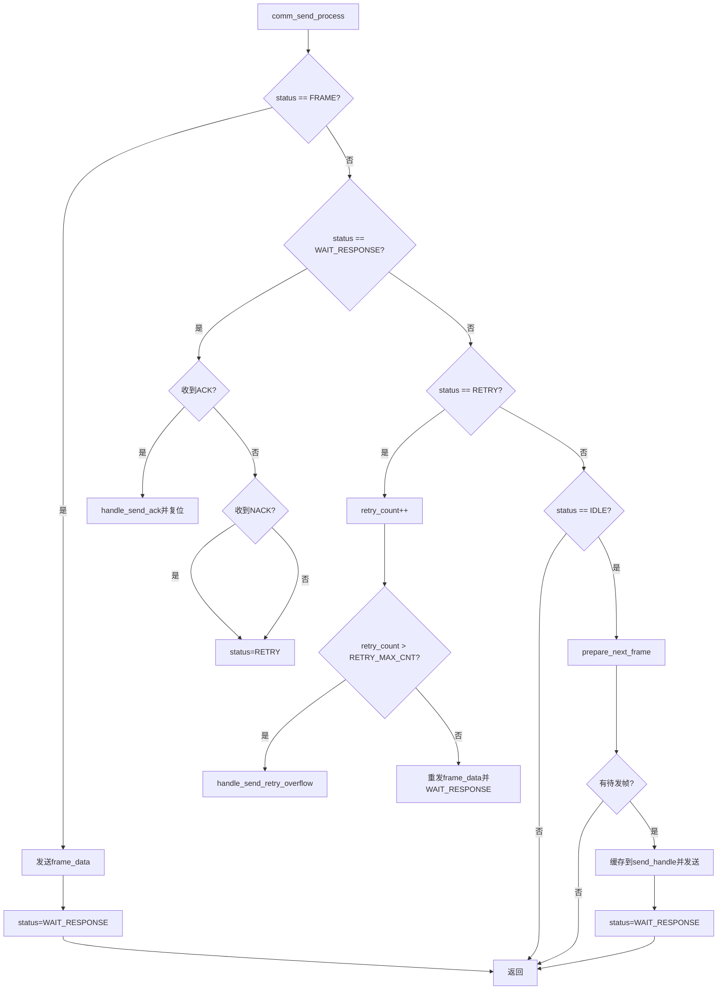
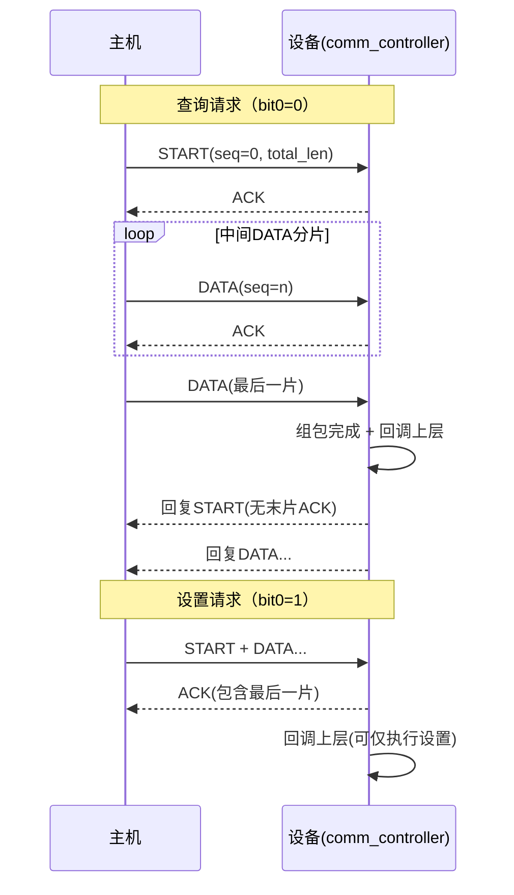

# comm_controller 通信控制器设计说明

## 1. 模块定位

`comm_controller` 负责自定义 HID 通道上的协议收发与会话管理，核心职责：

- 解析固定 64 字节协议帧并执行 CRC 校验。
- 将 `START + DATA` 分片重组为完整业务载荷。
- 调度发送状态机，处理 ACK/NACK/超时重试。
- 管理控制帧（ACK/NACK/ERROR）与业务回复帧。
- 维持单会话语义，避免并发会话互相污染。

对应代码：

- `KeyBoard/inc/comm_controller.h`
- `KeyBoard/src/comm_controller.c`

## 2. 对外接口

### `void comm_controller_process(void)`

- 周期调用入口（工程中为 5ms 节拍）。
- 内部顺序固定：先 `comm_recv_process()`，后 `comm_send_process()`。

### `void comm_register_rx_callback(comm_rx_callback_t callback)`

- 注册业务回调。
- 回调签名：
  `void (*comm_rx_callback_t)(uint8_t payload_type, const uint8_t* payload, uint16_t payload_len)`

### `void comm_queue_reply(uint8_t payload_type, const uint8_t* data, uint16_t len)`

- 入队业务回复（覆盖旧回复，单会话策略）。
- 参数校验：
  - `len > FRAME_SEND_MAX_BYTES` 直接忽略。
  - `len > 0 && data == NULL` 直接忽略。

## 3. 协议结构

## 3.1 帧结构 `Frame_Data_t`（固定 64 字节）

- `seq_num`：序号，`START` 固定 0，`DATA` 从 1 递增。
- `type`：帧类型（`FRAME_TYPE_*`）。
- `payload_length`：`payload.data` 的有效长度。
- `payload.type`：业务类型（`DATA_TYPE_*`）。
- `payload.data[56]`：载荷数据。
- `crc`：覆盖 `crc` 字段之前全部字节。

## 3.2 帧类型 `FRAME_TYPE`

- `ERROR(0)`：协议或状态错误。
- `START(1)`：会话起始帧（`payload.data[0..1]` 存总长度，小端）。
- `DATA(2)`：数据分片帧。
- `ACK(3)`：确认帧。
- `NACK(4)`：否认帧，请求重发。

## 3.3 业务类型 `DATA_TYPE` 与查询/设置规则

当前定义使用二进制字面量：

- `DATA_TYPE_GET_KEY = 0b0000`
- `DATA_TYPE_SET_LAYER = 0b0001`
- `DATA_TYPE_GET_LAYER_KEYMAP = 0b0010`
- `DATA_TYPE_SET_LAYER_KEYMAP = 0b0011`
- `DATA_TYPE_GET_ALL_LAYER_KEYMAP = 0b0100`

判定规则：

- `bit0 == 0`：查询类。
- `bit0 == 1`：设置类。

代码宏：

- `DATA_TYPE_IS_QUERY(type)`

## 4. 关键上下文对象

- `Receive_Handle_t`：接收会话上下文（类型、长度、分片进度、缓存、接收重试计数）。
- `Send_Handle_t`：发送状态机上下文（当前帧、状态、ACK/NACK 标志、重试计数、来源）。
- `Reply_Session_t`：业务回复会话（阶段、序号、总长度、已 ACK 长度、缓存）。

## 5. 接收流程（RX）

## 5.1 处理要点

1. 从 USB 端点读取 64 字节帧。
2. 校验 `seq_num <= SEQ_MAX_NUM`。
3. 校验 CRC，不通过则发送 `NACK` 并累计 `receive_handle.retry_count`。
4. 按 `frame.type` 分发：
   - `START`：建立新接收会话（必要时抢占并中止旧回复会话）。
   - `DATA`：按序组包并推进进度。
   - `ACK/NACK`：仅在发送状态机 `WAIT_RESPONSE` 且序号匹配时才采纳。
   - `ERROR`：释放接收会话缓存。
5. 长时间未收到完整帧且仍在等待 ACK 时，增加接收侧重试计数。
6. 接收重试超过 `RETRY_MAX_CNT` 时，复位接收状态。

## 5.2 查询/设置分流（末片 DATA）

在 `DATA` 收齐后：

- 查询类：末片 `DATA` 不回 ACK，直接进入回复流程（发送回复 `START`）。
- 设置类：末片 `DATA` 仍回 ACK，且通常不发送业务回复数据。

说明：中间分片仍保持 ACK 驱动，不改变分片可靠性。

## 5.3 RX 流程图

## 6. 发送流程（TX）

## 6.1 状态机

`SEND_STATUS`：

- `IDLE`：空闲，尝试调度下一帧。
- `FRAME`：已有待发帧（主要由控制帧抢占路径使用）。
- `WAIT_RESPONSE`：已发送，等待 ACK/NACK。
- `RETRY`：重发当前帧。

## 6.2 调度优先级

`prepare_next_frame()` 仅负责业务回复帧装配：

1. 业务回复 `START`
2. 业务回复 `DATA`

控制帧不再通过独立队列装配，而是由 `queue_control_frame()` 直接写入 `send_handle.frame_data` 并将状态置为 `SEND_STATUS_FRAME`（抢占当前发送节奏）。

## 6.3 ACK 推进规则

`handle_send_ack()` 根据 `send_handle.source` 推进：

- `TX_SOURCE_CONTROL`：仅确认完成，随后统一复位发送状态。
- `TX_SOURCE_REPLY_START`：
  - `payload_len == 0`：回复会话结束。
  - 否则进入 `REPLY_PHASE_SEND_DATA`。
- `TX_SOURCE_REPLY_DATA`：累计 `acked_payload_len`，全部确认后清空回复会话。

## 6.4 重试与失败

- `WAIT_RESPONSE` 下收到 `NACK` 或超时：进入 `RETRY`。
- `RETRY` 次数超过 `RETRY_MAX_CNT`：
  - 若失败源是业务回复帧，清空回复会话。
  - 发送 `ERROR` 控制帧。

## 6.5 TX 流程图

## 7. 查询/设置时序示意

## 8. 单会话与抢占语义

- 新接收会话到来（`START`）会中止当前业务回复会话。
- 新调用 `comm_queue_reply()` 会覆盖旧回复会话。
- 控制帧（ACK/NACK/ERROR）通过 `queue_control_frame()` 直接抢占发送状态机。

## 9. 上层接入现状（app）

当前 `app_comm_rx_callback()`：

- `GET_KEY / GET_LAYER_KEYMAP / GET_ALL_LAYER_KEYMAP`：调用 `comm_queue_reply()` 返回数据。
- `SET_LAYER / SET_LAYER_KEYMAP`：当前为预留分支（未发送业务回复）。

## 10. 主机测试脚本说明

`scripts/hid_comm_test.py` 已与当前协议对齐：

- 默认 `DATA_TYPE` 值已更新为新编码。
- 头文件枚举解析支持：
  - 二进制字面量 `0b...`
  - 十六进制字面量 `0x...`
  - 十进制字面量（含常见 C 后缀）

## 11. 常见排障建议

- 若主机侧收不到期望 ACK，先检查：
  - 帧长是否固定 64 字节。
  - CRC 输入范围是否与固件一致（`crc` 前 60 字节）。
  - `ACK/NACK` 序号是否与在途帧匹配。
- 若出现会话异常终止，重点看：
  - 序号连续性。
  - `payload_length` 边界。
  - `payload.type` 会话内一致性。
- 若长时间无响应，关注重试计数是否超过 `RETRY_MAX_CNT`。

---

最后更新时间：2026-03-21（按当前 `comm_controller.h/.c` 实现重建）