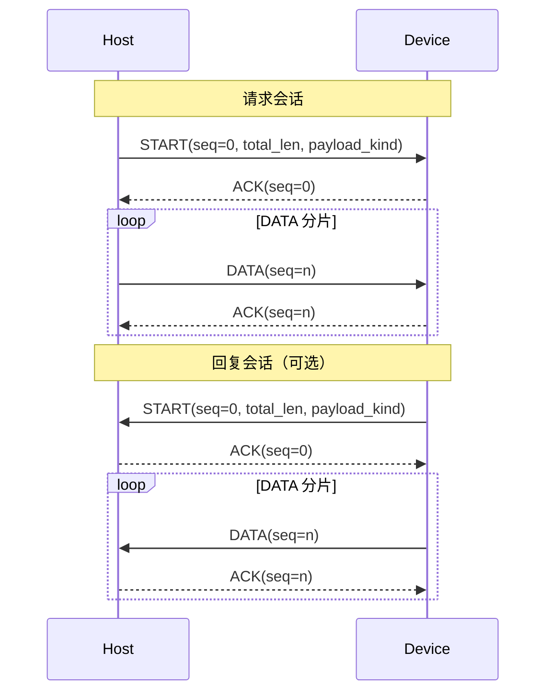
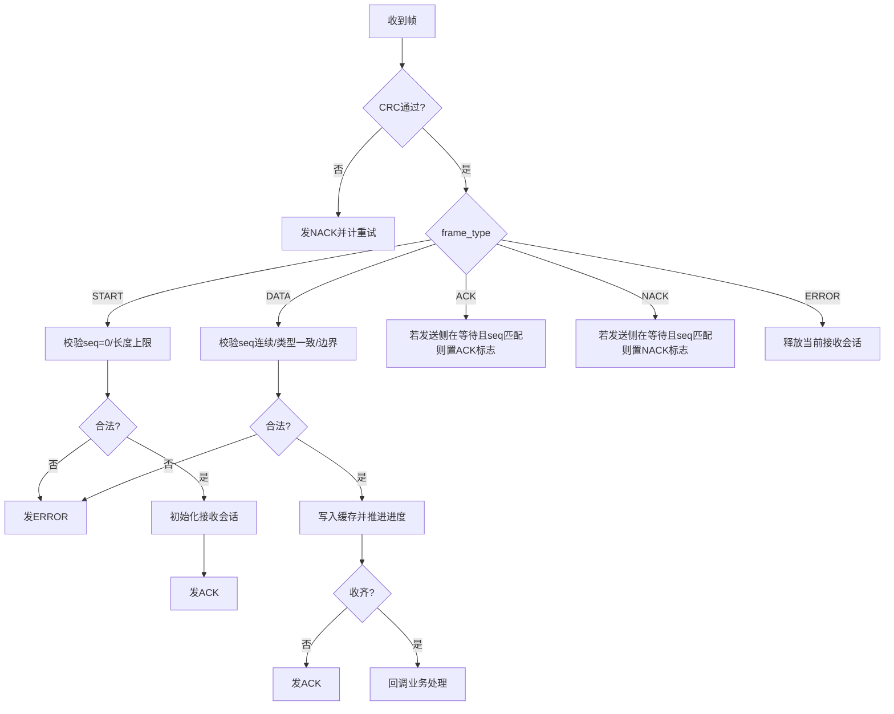
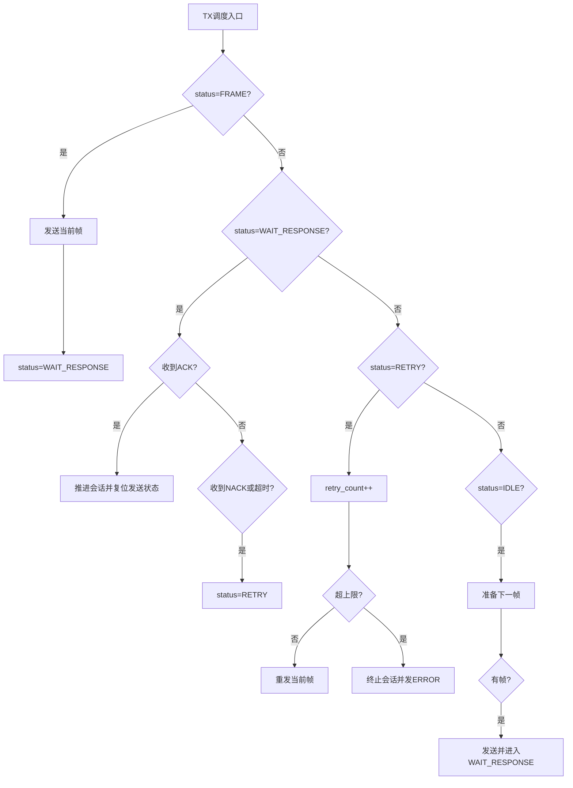

# 通用通信流程图（语言无关模板）

> 目标：提供一份可复用的“请求-应答 + 分片 + ACK/NACK + 重试”通用模板，便于在 C/C++/Rust/Go/Python/Java/JS 等语言中快速实现。

## 1. 角色与基本约定

- 主机端（Host）：发起请求并接收回复。
- 设备端（Device）：接收请求并处理后回复。
- 固定帧长：建议固定长度（例如 64 字节）以简化边界处理。
- 会话模型：`START + DATA*`。
- 控制帧：`ACK / NACK / ERROR`。
- 序号规则：`START.seq = 0`，`DATA.seq` 从 1 递增。

## 2. 通用帧模型

```text
Frame {
  seq_num         : u8
  frame_type      : enum { ERROR, START, DATA, ACK, NACK }
  payload_len     : u8
  payload_kind    : u8       // 业务类型（查询/设置/命令号）
  payload_bytes[] : bytes
  crc             : u32
}
```

## 3. 端到端时序（通用）



## 4. 接收状态机（RX）



## 5. 发送状态机（TX）



## 6. 查询/设置分流（可选优化）

当 `payload_kind` 可区分查询/设置时，可使用以下策略：

- 查询请求：最后一个 `DATA` 收齐后可跳过 ACK，直接发送回复 `START`，减少一次往返。
- 设置请求：最后一个 `DATA` 收齐后回 ACK 即可，不必发送业务回复体（除非需要返回执行结果）。

## 7. 可靠性规则（建议）

- 仅在 `WAIT_RESPONSE` 且 `seq` 匹配时接受 ACK/NACK。
- 每次发送均设置超时；超时等价于 NACK 进入重试。
- `retry_count > RETRY_MAX` 时结束会话并上报 ERROR。
- 收到新 `START` 时可抢占旧会话（单会话策略）。
- 所有异常路径都要“可恢复”：释放缓存 + 状态机回到 IDLE。

## 8. 语言无关伪代码（最小骨架）

```text
loop:
  rx_process()
  tx_process()

rx_process():
  frame = try_read_frame()
  if !frame: handle_rx_idle_timeout(); return
  if !crc_ok(frame): send_control(NACK); return

  switch frame.type:
    START:
      if !valid_start(frame): send_control(ERROR); reset_rx(); return
      reset_reply_if_needed()
      init_rx_session(frame)
      send_control(ACK)
      if total_len == 0: dispatch(payload_kind, empty)

    DATA:
      if !valid_data(frame): send_control(ERROR); reset_rx(); return
      append_chunk(frame)
      done = is_complete()
      if !(done && is_query(payload_kind)): send_control(ACK)
      if done: dispatch(payload_kind, payload)

    ACK:
      if tx_waiting && seq_match: tx_ack = true
    NACK:
      if tx_waiting && seq_match: tx_nack = true
    ERROR:
      reset_rx()


tx_process():
  if status == FRAME: send(current_frame); status = WAIT_RESPONSE; return

  if status == WAIT_RESPONSE:
    if tx_ack: on_ack(); return
    if tx_nack || timeout: status = RETRY

  if status == RETRY:
    retry_count += 1
    if retry_count > RETRY_MAX: on_retry_overflow(); return
    resend(current_frame)
    status = WAIT_RESPONSE
    return

  if status == IDLE:
    next = prepare_next_frame()
    if next: current_frame = next; send(next); status = WAIT_RESPONSE
```

## 9. 可配置参数（建议统一配置）

- `FRAME_SIZE`：固定帧长
- `PAYLOAD_CHUNK_SIZE`：单帧最大数据区
- `RETRY_MAX`
- `RX_TIMEOUT_MS`
- `TX_TIMEOUT_MS`
- `MAX_SESSION_BYTES`

## 10. 跨语言实现映射建议

- C/C++：结构体 + 状态机函数 + 定时器 tick。
- Rust：`enum + struct + match`，状态机更清晰。
- Go：goroutine + channel 分离收发。
- Python：类封装状态机，便于测试脚本快速迭代。
- Java/JS：对象状态 + 定时任务，统一超时逻辑。

---

这份文档可直接作为“协议生成提示词”的基础输入：

1. 先固定帧结构。  
2. 再生成 RX/TX 状态机代码骨架。  
3. 最后补业务回调与测试脚本。